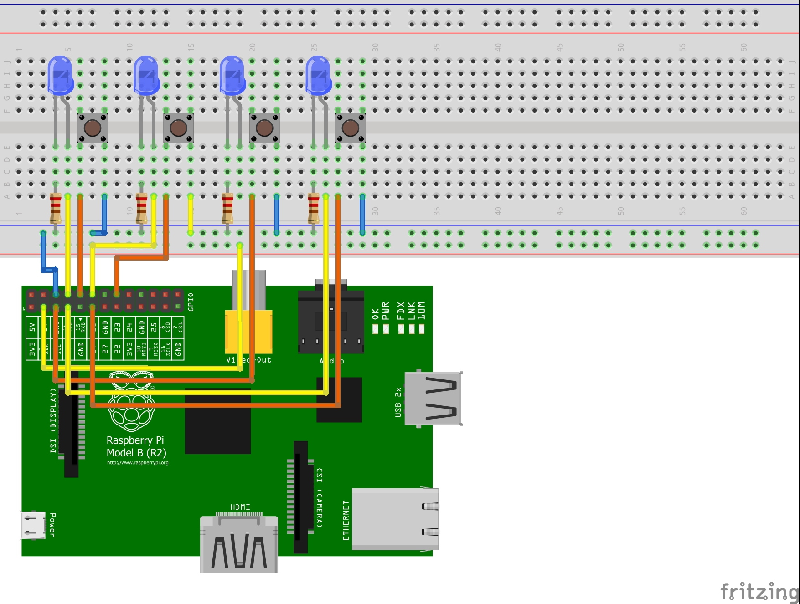

# APMS - Access Point Management Service

Button based power control for *TP-Link EAP225* devices using an *Raspberry Pi*. On-off switches for Access Points in LAN.

## Hardware

* *Raspberry Pi* (*Pi 1 B Rev 2* was tested, but basically all *Pis* with Ethernet adapter should work)
* Push Buttons and LEDs (in my case four times)
* Housing + Wires
* (optional) PoE Splitter for Power support such as [this one](berrybase.de/raspberry-pi-co/raspberry-pi/stromversorgung/zubehoer/poe-splitter-rj45-48v-micro-usb-5v/2-5a#)



## Setup

Enter your Access Point credentials in the [config file](./internal/config/config.go).

Edit the [build script](./build.sh) and add the IP of your Access Point. Run the script to build and upload the *apms* binary.

Run the following command once on the *Raspberry Pi* to register the service:

``` sh
sudo cp apms.service /lib/systemd/system/apms.service
sudo chmod 644 /lib/systemd/system/apms.service
sudo systemctl start apms
sudo systemctl enable apms
sudo reboot 0
```

## Debug

Run the following command on your *Raspberry Pi* to see the debug logs for the service:

``` sh
journalctl -e -u apms.service
```

## Update

Upgrade firmware of devices via: <https://www.tp-link.com/de/support/download/eap225/v3/#Firmware>
